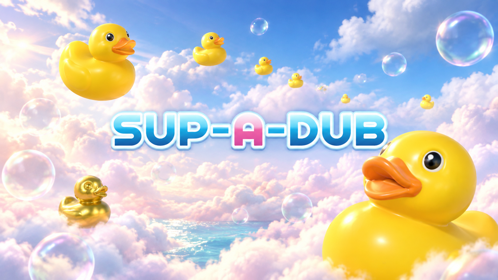
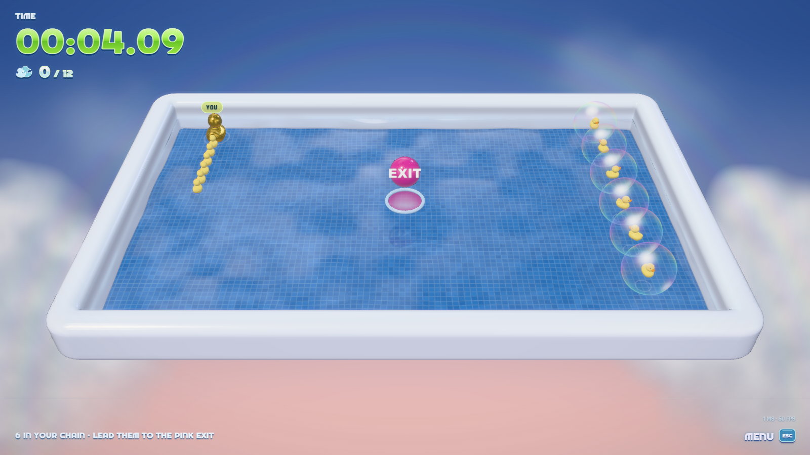
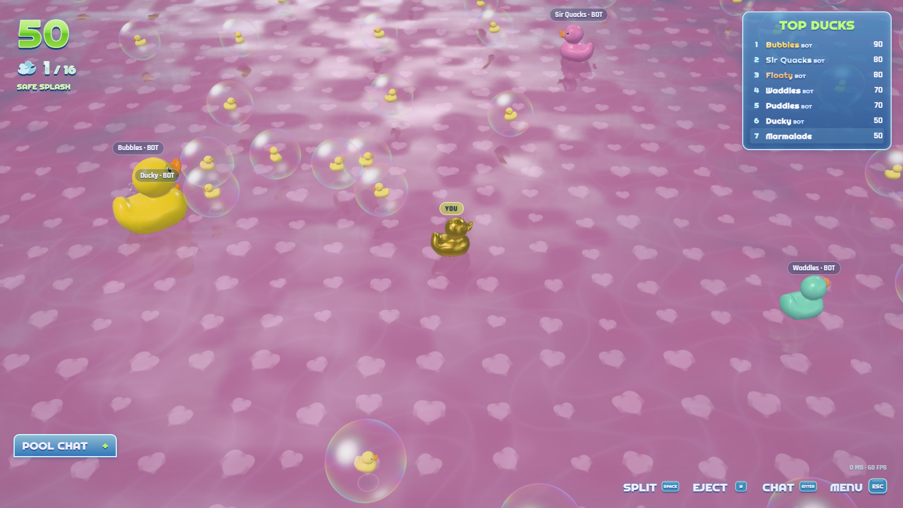
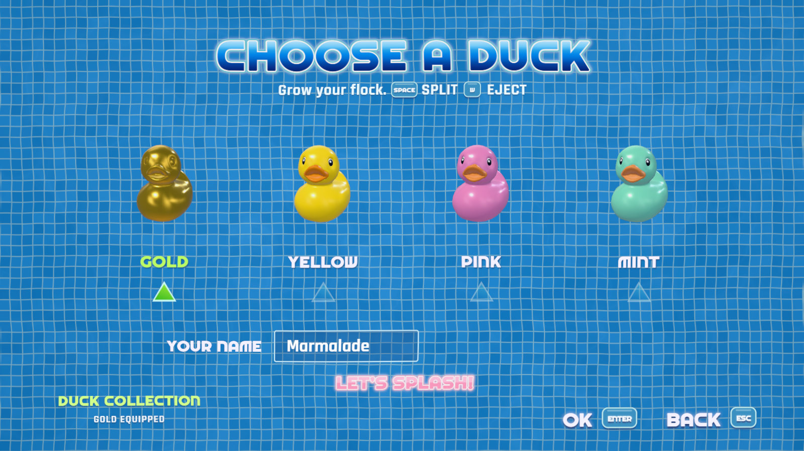
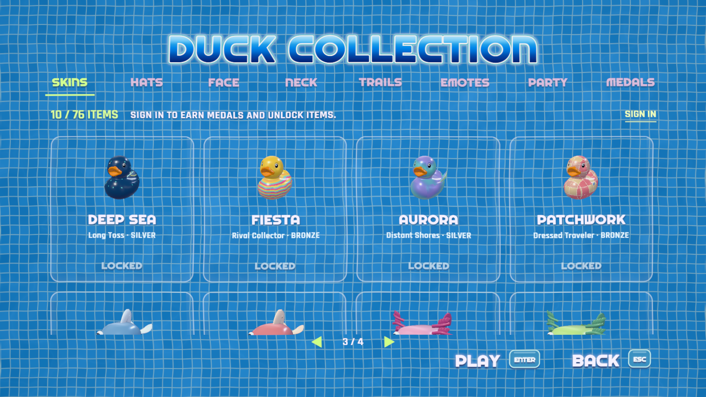

<p align="center">
  
</p>
<p align="center">
  
</p>

# Sup-a-Dub

The tub got bigger.

Sup-a-Dub brings the bath-toy charm of *Super Rub 'a' Dub* to a shared browser pool, with a little Agar.io mischief. Pop bubbles, collect ducklings, and grow. Split your flock to catch another player. Feed a shark and watch where it goes.

There is also a quiet corner: Tub 01, twelve stranded ducklings, one pink exit, and a clock to beat.

**[Gameplay](#gameplay) · [Gallery](#gallery) · [The game](#the-game) · [Run locally](#run-locally) · [Controls](#controls) · [Inside the project](#inside-the-project) · [Hosting](#hosting) · [Credits](#credits)**

## Gameplay

https://github.com/user-attachments/assets/c8769215-942b-4617-90d3-cf42ca05e8c8

[Download the clip](docs/marketing/video/gameplay.mp4)

## Gallery

Actual game captures. The cover above is separate promotional artwork.

| Bubble rescue | The endless pool |
| --- | --- |
|  |  |
| **Pick your duck** | **Open the toy box** |
|  |  |

[Full gallery and brand files](docs/marketing/index.html) · [Transparent logo](docs/marketing/brand/supadub-wordmark.png) · [Vector logo](docs/marketing/brand/supadub-wordmark.svg)

## The game

- **Endless:** a shared pool with streamed world chunks. Eat smaller flocks, split into up to 16 ducks, eject mass, and reunite your pieces.
- **Practice:** rescue all twelve ducklings, chase your best time, and watch the replay.
- **A proper toy box:** 40 avatar skins, 36 extra cosmetics, and 56 achievements with bronze, silver, and gold tiers. Hats, glasses, wakes, emotes, and celebrations are cosmetic.
- **Your place in the pool:** accounts, saved controls, profiles, country flags, daily and weekly rankings, chat, and staff moderation.
- **The bath-time details:** glossy toys, soap bubbles, water-driven menu transitions, four tile themes, and six original scores that react to play.

This is a working game under active development. The original game's exact visuals and timing are still a work in progress.

## Run locally

Install **Bun 1.4 or later**, then run these commands from the repository folder:

```sh
bun install --frozen-lockfile
bun run dev
```

Open **http://localhost:5173**. Vite serves the client on 5173 and Bun runs the game server on 3001. Accounts and progress use a local SQLite database.

For the production build:

```sh
bun run build
bun run start
```

Open **http://localhost:3001**. Bun serves the client, API, and WebSocket connection from one origin. No external database service is required.

The promotional page runs at **http://localhost:3001/promo/** after the production build. The game stays at the root address.

For page design work, run `bun run dev:promo` in another terminal. Open **http://localhost:5174/promo/**. Its play buttons open the game on port 5173. Set `VITE_GAME_URL` before the build to change their destination.

## Controls

| Action | Default |
| --- | --- |
| Swim | Pointer or arrow keys |
| Split | Space |
| Eject mass | W |
| Quack | Q |
| Emotes | R |
| Chat | Enter |
| Menu | Escape |

Prefer W to swim forward? Choose **Options → Controls → WASD + E EJECT**. You can also remap individual actions. Signed-in accounts save bindings across sessions. Guest bindings stay on the device.

Controller prompts support Xbox, PlayStation, Nintendo, and generic layouts. Touch players drag in the pool and use the on-screen buttons.

## Inside the project

The monorepo separates game content from the engines that run it.

| Location | Responsibility |
| --- | --- |
| `apps/web` | Menus, input, accounts, and the game client |
| `apps/marketing` | Promotional page, replay player, and toy previews |
| `apps/server` | Authoritative simulation, sessions, moderation, and SQLite |
| `packages/simulation`, `protocol`, `network` | Game rules and bounded message transport |
| `packages/gameengine`, `graphics` | Scenes, water, cameras, and rendering |
| `packages/audioengine`, `inputengine`, `core`, `features` | Reusable controllers and services |
| `packages/assets`, `cosmetics`, `achievements` | Models, sounds, artwork, catalogs, and rewards |

Run `bun run typecheck` for strict TypeScript checks. `bun run format:check` checks formatting. GitHub Actions checks the public install and build.

[Architecture](docs/ARCHITECTURE.md) covers ownership, limits, and extension points.

## Hosting

You need a Bun process, persistent storage for SQLite, and an HTTPS proxy that supports WebSockets. Static hosting alone is not enough.

See [the hosting guide](docs/HOSTING.md) for origins, cookies, backups, and administrator setup. Registration never grants staff access automatically.

## Credits

*Super Rub 'a' Dub* and Agar.io are the inspirations. Sup-a-Dub is an independent project, with no affiliation to their publishers.

The duck model comes from Sony's licensed Khronos sample. Fonts, model notices, and their separate license terms stay with the assets. The music, shaders, extra toys, and interface artwork are project creations.

[Asset credits and modifications](packages/assets/ASSET-PROVENANCE.md) · [Third-party notices](THIRD_PARTY_NOTICES.md) · [Music](packages/assets/music/README.md)
